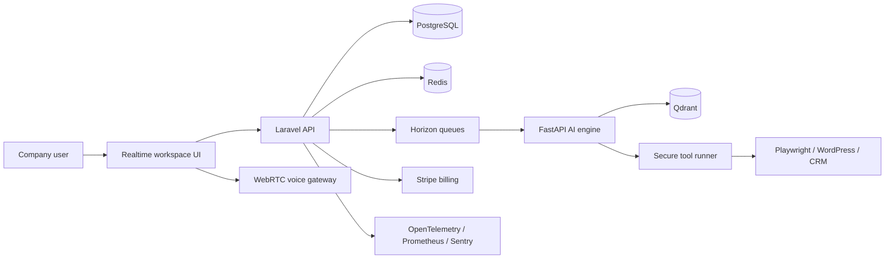
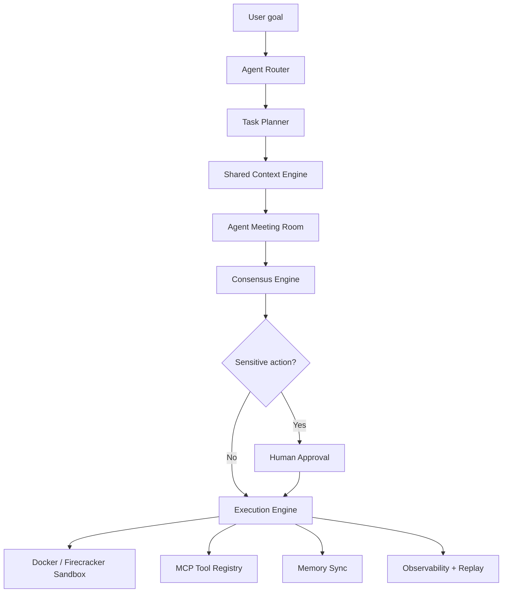

# Enterprise AI Business Operating System Architecture

This repository contains the Figma-derived React interface plus production scaffolding for a multi-tenant AI workforce SaaS.

## Runtime Topology

## Tenancy

- Every request resolves a `tenant_id` from the authenticated company workspace.
- Business records, agent records, memory, invoices, workflows, and audit logs are scoped by `tenant_id`.
- Vector memory uses Qdrant namespaces like `tenant_{tenant_id}_company_brain`.
- Tool credentials are encrypted and granted to agents using explicit policies.
- Queue jobs carry tenant context and fail closed if the tenant cannot be resolved.

## Core Services

- Frontend: realtime AI workspace, voice UX, CRM, SEO, automation builder, marketplace, admin dashboards.
- Laravel API: authentication, RBAC, billing, subscriptions, workflow CRUD, audit logs, queue dispatching.
- FastAPI AI Engine: planner, multi-agent graph, memory retrieval, tool routing, AI meeting consensus.
- Tool Runner: isolated Playwright sessions, WordPress automation, CRM/email/WhatsApp connectors.
- Memory Plane: Redis short-term state, PostgreSQL canonical memory, Qdrant vector search.

## Multi-Agent OS Core

- Agent Registry: stores agent hierarchy, personality, tools, KPI targets, cost profile, and risk level.
- Agent Router: maps goals to CEO, manager, specialist, QA, security, and cost agents.
- Task Planner: decomposes objectives into prioritized tasks with retry policy and approval requirements.
- Goal Manager: preserves success metrics and competing constraints such as cost, quality, latency, and safety.
- Meeting Room: creates a structured debate with moderator, specialists, critic, reviewer, and executor roles.
- Consensus Engine: combines agent votes, confidence, risk, and reviewer feedback into an executable plan.
- Shared Context Engine: retrieves company, project, user behavior, workflow, and agent memory.
- Execution Engine: schedules tools and workflow nodes through queues and sandbox jobs.
- Human Approval Layer: pauses sensitive actions before email, publishing, deploy, deletion, payment, or database writes.
- Observability Layer: records prompt logs, token logs, tool logs, traces, and execution replay artifacts.

## Voice Flow

1. Browser starts a WebRTC session and streams microphone audio.
2. Voice gateway connects to OpenAI Realtime, Deepgram, or another provider.
3. Partial transcripts are broadcast to the workspace over WebSockets.
4. Planner routes commands to agents, workflows, or meeting rooms.
5. TTS audio is streamed back with interruption support.
6. Summaries are stored into tenant memory after policy checks.

## Event Model

- `AgentTaskRequested`
- `AgentTaskCompleted`
- `WorkflowExecutionStarted`
- `WorkflowExecutionFailed`
- `VoiceSessionMetered`
- `ToolCallApproved`
- `ToolCallExecuted`
- `MemoryIngested`
- `SubscriptionUsageRecorded`

## Production Readiness Checklist

- Use PostgreSQL row-level policies or strict application-scoped tenancy.
- Store secrets in a managed vault or encrypted Laravel casts.
- Emit audit logs for every agent action and external tool call.
- Enforce usage limits before expensive LLM, voice, image, and browser operations.
- Instrument all queues and AI calls with OpenTelemetry trace IDs.
- Deploy workers separately from API pods and autoscale on queue depth.
