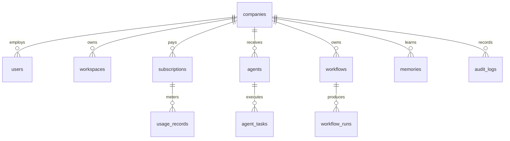

# Database Schema

Core PostgreSQL tables for the SaaS control plane.

## Tables

- `companies`: legal name, industry, locale, domain, brand voice, billing profile.
- `users`: company membership, authentication identity, role, status.
- `workspaces`: company workspace settings and realtime presence metadata.
- `agents`: installed agent definitions, capabilities, status, KPI config.
- `agent_tasks`: task state, assigned agent, approval mode, result payload, cost.
- `meetings`: AI meeting sessions, participants, consensus score, summary.
- `workflows`: visual workflow definitions with triggers, nodes, edges, policies.
- `workflow_runs`: execution logs, node statuses, retries, output artifacts.
- `memories`: canonical long-term memory records with classification and source.
- `vector_documents`: Qdrant point IDs, embeddings metadata, namespace, source hash.
- `tool_connections`: encrypted credentials and per-agent permission grants.
- `subscriptions`: Stripe customer/subscription IDs, plan, status, trial dates.
- `usage_records`: tokens, voice minutes, browser minutes, storage, image generations.
- `invoices`: Stripe invoice IDs, totals, status, hosted invoice URL.
- `audit_logs`: actor, action, target, tenant, IP, trace ID, risk level.

## Indexing

- Composite indexes start with `tenant_id` on tenant-owned tables.
- Add partial indexes for active workflows, active agents, and unprocessed tasks.
- Use `pg_trgm` for CRM and company-brain text lookup.
- Store vector payload IDs in PostgreSQL but keep embeddings in Qdrant.
